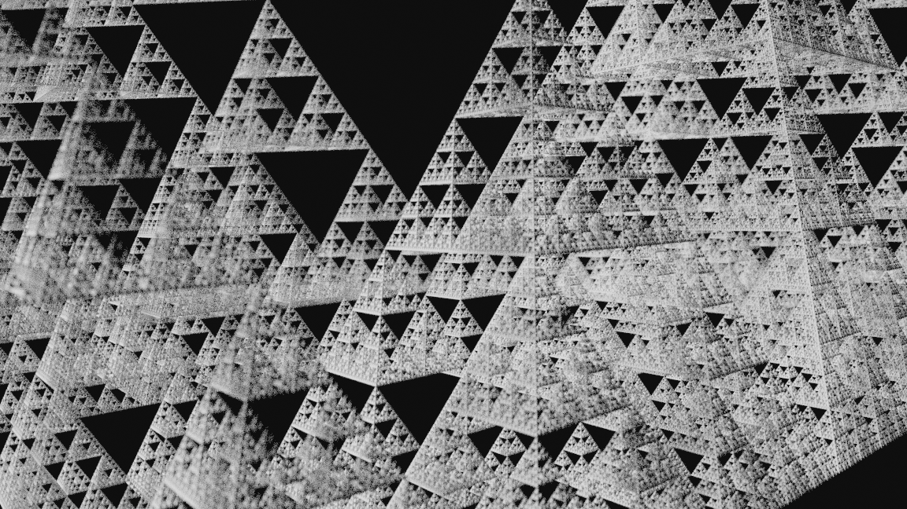

# recursive_3d
Blender python script




## To execute script in Blender: 


```python
import sys
import os
import importlib

import bpy

blend_dir = os.path.dirname(bpy.data.filepath)
if blend_dir not in sys.path:
   sys.path.append(blend_dir)

import tri_mesh, custom_types, tetra

importlib.reload(custom_types)
importlib.reload(tri_mesh)
importlib.reload(tetra)
tetra.main()
```


or use:

```
filename = "FULL PARTH to tri_mesh.py"
exec(compile(open(filename).read(), filename, 'exec'))
```
